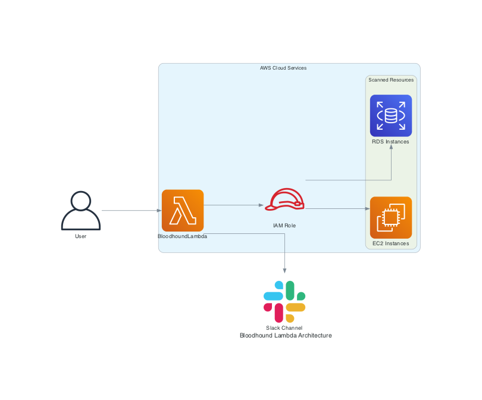

# Bloodhound Lambda Function

## Table of Contents

- [Overview](#overview)
- [Prerequisites](#prerequisites)
- [Setup Steps](#setup-steps)
  - [1. Create a Slack App](#1-create-a-slack-app)
  - [2. Add Bot Permissions](#2-add-bot-permissions)
  - [3. Get the Slack Channel ID](#3-get-the-slack-channel-id)
  - [4. Invite the Bot to the Channel](#4-invite-the-bot-to-the-channel)
  - [5. Prepare the Lambda Function Code](#5-prepare-the-lambda-function-code)
  - [6. Package and Deploy the Lambda Function](#6-package-and-deploy-the-lambda-function)
  - [7. Create an IAM Role for Lambda](#7-create-an-iam-role-for-lambda)
  - [8. Set Up Environment Variables in AWS Lambda](#8-set-up-environment-variables-in-aws-lambda)
  - [9. Test the Lambda Function](#9-test-the-lambda-function)
  - [10. GitHub Actions Setup](#10-github-actions-setup)
- [Conclusion](#conclusion)

## Overview

The Bloodhound Lambda function is designed to scan AWS regions for EC2 and RDS instances and post a summary to a Slack channel. This README provides detailed steps to set up, deploy, and test the Lambda function, including Slack integration.



## Prerequisites

- AWS account with permissions to create IAM roles, Lambda functions, and access to EC2 and RDS.
- Slack workspace with permission to create and install Slack apps.
- Python 3.8 installed locally for testing and packaging the Lambda function.

## Setup Steps

### 1. Create a Slack App

1. Go to the Slack API website: [Slack API: Applications](https://api.slack.com/apps).
2. Click on "Create New App".
3. Choose "From scratch".
4. Give your app a name and select the Slack workspace where you have permissions to install the app.
5. Click "Create App".

### 2. Add Bot Permissions

1. In your Slack app settings, go to "OAuth & Permissions".
2. Under "OAuth Tokens & Redirect URLs", scroll down to "Scopes".
3. Add the following bot token scopes:
   - `chat:write`: To post messages in channels.
   - `channels:read`: To read information about channels.
   - `groups:read`: To read information about private channels.
4. At the top of the "OAuth & Permissions" page, click "Install App to Workspace".
5. Review the permissions and click "Allow".
6. Copy the OAuth Access Token; you'll need this as the `SLACK_BOT_TOKEN`.

### 3. Get the Slack Channel ID

1. Open Slack and navigate to the channel where you want the bot to post messages.
2. Click on the channel name to open the channel details.
3. Copy the channel ID from the URL or the channel details pane. The channel ID starts with `C` for public channels or `G` for private channels.

### 4. Invite the Bot to the Channel

1. In Slack, go to the channel where you want the bot to post messages.
2. Type `/invite @your-bot-name` to invite the bot to the channel. Replace `your-bot-name` with the actual name of your bot.

### 5. Prepare the Lambda Function Code

1. Create a directory for your Lambda function code:

```sh
mkdir bloodhound_lambda
cd bloodhound_lambda
```

2. Create a file named `lambda_function.py` and add the following code:

```python
import boto3
import os
from slack_sdk import WebClient
from slack_sdk.errors import SlackApiError

# Adjust based on the regions you want to scan
STUDENT_REGIONS = [
    "us-east-1",
    "us-east-2",
    "us-west-1",
    "us-west-2",
]

def create_session(region):
    return boto3.Session(region_name=region)

def search_regions_for_rds_resources(session):
    rds_instances = []
    print(f"Sniffing out rds resources in {session.region_name}...")
    rds = session.client("rds")
    response = rds.describe_db_instances()
    for dbinstance in response["DBInstances"]:
        rds_instances.append(dbinstance["DBInstanceIdentifier"])
    return {"rds": rds_instances}

def search_regions_for_ec2_resources(session):
    ec2_instances = []
    print(f"Sniffing out ec2 resources in {session.region_name}...")
    ec2 = session.client("ec2")
    response = ec2.describe_instances()
    try:
        if len(response["Reservations"]) == 1:
            for ec2instance in response["Reservations"][0]["Instances"]:
                if ec2instance["State"]["Name"] in ("stopped", "terminated"):
                    continue
                ec2_instances.append(ec2instance["InstanceId"])
        else:
            for ec2instance in response["Reservations"]:
                if ec2instance["Instances"][0]["State"]["Name"] in ("stopped", "terminated"):
                    continue
                ec2_instances.append(ec2instance["Instances"][0]["InstanceId"])
    except IndexError:
        return {"ec2": []}
    return {"ec2": ec2_instances}

def format_message(resources):
    message = ":dog2: Woof! Woof! :dog2:\n Bloodhound found the following resources in use: \n"
    for region in resources.keys():
        if len(resources[region]["ec2"]) == 0 and len(resources[region]["rds"]) == 0:
            continue
        message += f'- *{region.upper()}*: {len(resources[region]["ec2"])} ec2 instances, {len(resources[region]["rds"])} rds instances\n'
    message += f"Please stop or terminate all unneeded resources!"
    return message

def send_slack_message(message):
    try:
        slack_bot_token = os.environ.get("SLACK_BOT_TOKEN")
        channel_id = os.environ.get("CHANNEL_ID")

        client = WebClient(token=slack_bot_token)
        response = client.chat_postMessage(
            channel=channel_id,
            text=message
        )
        print(f"Slack message response: {response}")
    except SlackApiError as e:
        print(f"Error sending message to Slack: {e.response['error']}")

def lambda_handler(event, context):
    resources_in_regions = {}
    print(f"Going hunting in regions {STUDENT_REGIONS}")
    for region in STUDENT_REGIONS:
        session = create_session(region)
        resources_in_regions[region] = search_regions_for_ec2_resources(session)
        resources_in_regions[region].update(search_regions_for_rds_resources(session))
    message = format_message(resources_in_regions)
    print(message)
    send_slack_message(message)
    return message
```

3. Create a `requirements.txt` file with the following content:

```text
slack_sdk
boto3
```

### 6. Package and Deploy the Lambda Function

1. Install the dependencies and create a deployment package:

```sh
pip install -r requirements.txt -t .
zip -r9 ../bloodhound_lambda.zip .
```

2. Create the Lambda function using the AWS CLI:

```sh
aws lambda create-function --function-name BloodhoundLambda \
--zip-file fileb://bloodhound_lambda.zip --handler lambda_function.lambda_handler --runtime python3.8 \
--role arn:aws:iam::<YOUR_ACCOUNT_ID>:role/BloodhoundLambdaRole --region us-west-2
```

Replace `<YOUR_ACCOUNT_ID>` with your actual AWS account ID.

### 7. Create an IAM Role for Lambda

1. Go to the [IAM console](https://console.aws.amazon.com/iam/).
2. Create a new role:
   - Choose the "Lambda" service.
   - Attach the following policies:
     - `AWSLambdaBasicExecutionRole`
     - `AmazonEC2ReadOnlyAccess`
     - `AmazonRDSReadOnlyAccess`
3. Note the ARN of the created role.

### 8. Set Up Environment Variables in AWS Lambda

1. Navigate to the [AWS Lambda Console](https://console.aws.amazon.com/lambda/).
2. Select your BloodhoundLambda function.
3. Go to the "Configuration" tab and then "Environment variables".
4. Add the following environment variables:
   - `SLACK_BOT_TOKEN`: Your Slack bot token.
   - `CHANNEL_ID`: Your Slack channel ID.
5. Save the changes.

### 9. Test the Lambda Function

1. Create a test event named `test_event.json` with the following content:

```json
{}
```

2. Invoke the Lambda function:

```sh
aws lambda invoke --function-name BloodhoundLambda --payload file://test_event.json output.txt --region us-west-2
```

3. Check the contents of `output.txt` and review the CloudWatch logs to ensure the function executed correctly.

### 10. GitHub Actions Setup

#### 1. Create the Workflow File

Create the file `.github/workflows/invoke_lambda.yml` in your repository.

#### 2. Add the Workflow Configuration

Add the following content to the `invoke_lambda.yml` file:

```yaml
name: Invoke Bloodhound Lambda

on:
  schedule:
    # Run at 11 AM and 11 PM EST (4 PM and 4 AM UTC)
    - cron: "0 16,4 * * *"
  workflow_dispatch:

jobs: invoke

-lambda:
  runs-on: ubuntu-latest

  steps:
    - name: Checkout repository
      uses: actions/checkout@v2

    - name: Set up AWS CLI
      uses: aws-actions/configure-aws-credentials@v1
      with:
        aws-access-key-id: ${{ secrets.AWS_ACCESS_KEY_ID }}
        aws-secret-access-key: ${{ secrets.AWS_SECRET_ACCESS_KEY }}
        aws-region: us-west-2

    - name: Invoke Bloodhound Lambda function
      run: |
        echo '{}' > test_event.json
        aws lambda invoke --function-name BloodhoundLambda --payload file://test_event.json output.txt --region us-west-2
        cat output.txt
```

#### 3. Add AWS Credentials to GitHub Secrets

1. Go to your repository on GitHub.
2. Click on "Settings".
3. Click on "Secrets and variables" in the left sidebar, then click on "Actions".
4. Click "New repository secret".
5. Add the following secrets:
   - `AWS_ACCESS_KEY_ID`: Your AWS access key ID.
   - `AWS_SECRET_ACCESS_KEY`: Your AWS secret access key.

#### 4. Push the Workflow to GitHub

Commit and push the `.github/workflows/invoke_lambda.yml` file to your repository.

#### 5. Verify the Workflow

1. Go to the "Actions" tab in your GitHub repository.
2. You should see the new workflow listed. It will run according to the schedule and can also be manually triggered.

## Conclusion

By following these steps, you have successfully set up, deployed, and tested the Bloodhound Lambda function with Slack integration. The function scans AWS regions for EC2 and RDS instances and posts a summary to the specified Slack channel. Additionally, you have set up a GitHub Action to invoke the Lambda function twice a day at 11 AM and 11 PM EST. Ensure to review the logs and Slack messages to confirm the function's correct behavior.

---
